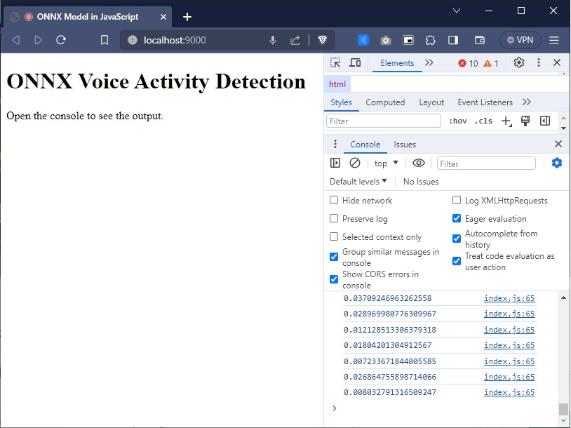

# Voice Activity Detection in JavaScript

This repository provides a client-side Voice Activity Detection (VAD) implementation using the ONNX version of Silero VAD - https://github.com/snakers4/silero-vad

## Overview

Voice Activity Detection (VAD) is an essential feature in digital communication systems, allowing the detection of the presence or absence of human speech. This JavaScript implementation runs directly in the browser, providing real-time VAD without the need for server-side processing.

## Features

- Real-time voice activity detection in the browser
- Utilizes the efficient ONNX runtime for JavaScript
- Easy to integrate with other web-based audio processing tools

## Example

The following image shows the Voice Activity Detection system in action. Notice the console output, which displays higher numerical values when speech is detected, indicating the presence of voice activity.

## Install

To use this VAD in your project, include the ONNX model file and the associated JavaScript code that handles the audio processing and VAD inference.

1. run javascript-install.bat ( npm install )
2. run javascript-run.bat ( npm run build && npm run start )
3. This will open a browser. Enable your microphone and inspect the console logs (f12)